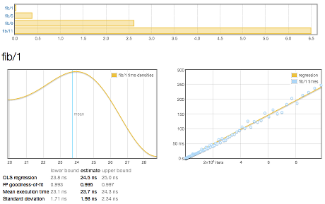

% A criterion tutorial
% Learn how to write Haskell microbenchmarks.

# Installation

To install the `criterion` package, simply use `cabal`, the standard Haskell
package management command.

~~~~
cabal update
cabal install -j --disable-tests criterion
~~~~

Depending on how many prerequisites you already have installed, and
what your Cabal configuration looks like, the build will probably take
just a few minutes.

# Getting started

Here's a a simple and complete benchmark, measuring the performance of
the ever-ridiculous `fib` function.

~~~~ {.haskell}
import Criterion.Main

-- The function we're benchmarking.
fib m | m < 0     = error "negative!"
      | otherwise = go m
  where
    go 0 = 0
    go 1 = 1
    go n = go (n-1) + go (n-2)

-- Our benchmark harness.
main = defaultMain [
  bgroup "fib" [ bench "1"  $ whnf fib 1
               , bench "5"  $ whnf fib 5
               , bench "9"  $ whnf fib 9
               , bench "11" $ whnf fib 11
               ]
  ]
~~~~
([examples/Fibber.hs](https://github.com/bos/criterion/blob/master/examples/Fibber.hs))

The
[`defaultMain`](http://hackage.haskell.org/package/criterion/docs/Criterion-Main.html#v:defaultMain)
function takes a list of
[`Benchmark`](http://hackage.haskell.org/package/criterion/docs/Criterion-Main.html#t:Benchmark)
values, each of which describes a function to benchmark.  (We'll come
back to `bench` and `whnf` shortly, don't worry.)

To maximise our convenience, `defaultMain` will parse command line
arguments and then run any benchmarks we ask.  Let's compile our
benchmark program.

~~~~
$ ghc -O --make Fibber
[1 of 1] Compiling Main             ( Fibber.hs, Fibber.o )
Linking Fibber ...
~~~~

If we run our newly compiled `Fibber` program, it will benchmark all
of the functions we specified.

~~~~
$ ./Fibber --output fibber.html
benchmarking fib/1
time                 23.91 ns   (23.30 ns .. 24.54 ns)
                     0.994 R²   (0.991 R² .. 0.997 R²)
mean                 24.36 ns   (23.77 ns .. 24.97 ns)
std dev              2.033 ns   (1.699 ns .. 2.470 ns)
variance introduced by outliers: 88% (severely inflated)

...more output follows...
~~~~

Even better, the `--output` option directs our program to write a
report to the file [`fibber.html`](fibber.html).  Click on the image
to see a complete report.  If you mouse over the data points in the
charts, you'll see that they are *live*, giving additional information
about what's being displayed.

<a href="fibber.html" target="_blank"></img></a>

# Understanding charts

A report begins with a summary of all the numbers measured.
Underneath is a breakdown of every benchmark, each with two charts and
some explanation.

The chart on the left is a
[kernel density estimate](https://en.wikipedia.org/wiki/Kernel_density_estimation)
(also known as a KDE) of time measurements.  This graphs the
*probability* of any given time measurement occurring.  A spike
indicates that a measurement of a particular time occurred; its height
indicates how often that measurement was repeated.

#### Why not use a histogram?

A more popular alternative to the KDE for this kind of display is the
[histogram](https://en.wikipedia.org/wiki/Histogram).  Why do we use a
KDE instead?  In order to get good information out of a histogram, you
have to
[choose a suitable bin size](https://en.wikipedia.org/wiki/Histogram#Number_of_bins_and_width).
This is a fiddly manual task.  In contrast, a KDE is likely to be
informative immediately, with no configuration required.

The chart on the right contains the raw measurements from which the
kernel density estimate was built. The $x$ axis indicates the number
of loop iterations, while the $y$ axis shows measured execution time
for the given number of iterations. The line "behind" the values is a
linear regression generated from this data.  Ideally, all measurements
will be on (or very near) this line.

## Understanding the data under a chart

Underneath the chart for each benchmark is a small table of
information that looks like this.

<table>
  <thead>
   <tr><th></th>
   <th style="opacity:0.6;font-weight:500;" title="0.95 confidence level">lower bound</th>
   <th style="font-weight:500">estimate</th>
   <th style="opacity:0.6;font-weight:500;" title="0.95 confidence level">upper bound</th>
  </tr></thead>
  <tbody>
   <tr>
    <td title="Estimate of expected time for a single execution.">OLS regression</td>
    <td title="95% of estimates fall above this value.">31.0 ms</td>
    <td title="Estimate of expected execution time.">37.4 ms</td>
    <td title="95% of estimates fall below this value.">42.9 ms</td>
   </tr>
   <tr>
    <td title="Numeric description of the how well the OLS estimate above fits the actual data.">R² goodness-of-fit</td>
    <td title="95% of estimates fall above this value. Note that this lower bound is suspiciously low, as it is less than 0.9.">0.887</td>
    <td title="This value is between 0 and 1. A value below 0.99 indicates a somewhat poor fit. Values below 0.9 are outright suspicious.">0.942</td>
    <td title="95% of estimates fall below this value.">0.994</td>
   </tr>
   <tr>
    <td>Mean execution time</td>
    <td title="95% of estimates fall above this value.">34.8 ms</td>
    <td title="The estimated mean execution time.">37.0 ms</td>
    <td title="95% of estimates fall below this value.">43.1 ms</td>
   </tr>
   <tr>
    <td>Standard deviation</td>
    <td title="95% of estimates fall above this value.">2.11 ms</td>
    <td title="The estimated standard deviation of execution time.">6.49 ms</td>
    <td title="95% of estimates fall below this value.">11.0 ms</td>
   </tr>
  </tbody>
 </table>

The first two rows are the results of a linear regression run on the measurements displayed in the right-hand chart.

* "**OLS regression**" estimates the time needed for a single
  execution of the activity being benchmarked, using an
  [ordinary least-squares regression model](https://en.wikipedia.org/wiki/Ordinary_least_squares).
  This number should be similar to the "mean execution time" row a
  couple of rows beneath.  The OLS estimate is usually more accurate
  than the mean, as it more effectively eliminates measurement
  overhead and other constant factors.

* "**R² goodness-of-fit**" is a measure of how accurately the linear
  regression model fits the observed measurements. If the measurements
  are not too noisy, R² should lie between 0.99 and 1, indicating an
  excellent fit. If the number is below 0.99, something is confounding
  the accuracy of the linear model.  A value below 0.9 is outright
  worrisome.

* "**Mean execution time**" and "**Standard deviation**" are
  statistics calculated (more or less) from execution time divided by
  number of iterations.

On either side of the main column of values are greyed-out lower and
upper bounds.  These measure the *accuracy* of the main estimate using
a statistical technique called
[*bootstrapping*](https://en.wikipedia.org/wiki/Bootstrapping_(statistics)). This
tells us that when randomly resampling the data, 95% of estimates fell
within between the lower and upper bounds.  When the main estimate is
of good quality, the lower and upper bounds will be close to its
value.

# Reading command line output

Before you look at HTML reports, you'll probably start by inspecting
the report that criterion prints in your terminal window.

~~~~
benchmarking ByteString/HashMap/random
time                 4.046 ms   (4.020 ms .. 4.072 ms)
                     1.000 R²   (1.000 R² .. 1.000 R²)
mean                 4.017 ms   (4.010 ms .. 4.027 ms)
std dev              27.12 μs   (20.45 μs .. 38.17 μs)
~~~~

The first column is a name; the second is an estimate. The third and
fourth, in parentheses, are the 95% lower and upper bounds on the
estimate.

* `time` corresponds to the "OLS regression" field in the HTML table
  above.

* `R²` is the goodness-of-fit metric for `time`.

* `mean` and `std dev` have the same meanings as "Mean execution time"
  and "Standard deviation" in the HTML table.

# How to write a benchmark suite

A criterion benchmark suite consists of a series of
[`Benchmark`](http://hackage.haskell.org/package/criterion/docs/Criterion-Main.html#t:Benchmark)
values.

~~~~ {.haskell}
main = defaultMain [
  bgroup "fib" [ bench "1"  $ whnf fib 1
               , bench "5"  $ whnf fib 5
               , bench "9"  $ whnf fib 9
               , bench "11" $ whnf fib 11
               ]
  ]
~~~~

We group related benchmarks together using the
[`bgroup`](http://hackage.haskell.org/package/criterion/docs/Criterion-Main.html#v:bgroup)
function.  Its first argument is a name for the group of benchmarks.

~~~~ {.haskell}
bgroup :: String -> [Benchmark] -> Benchmark
~~~~

All the magic happens with the
[`bench`](http://hackage.haskell.org/package/criterion/docs/Criterion-Main.html#v:bench)
function.  The first argument to `bench` is a name that describes the
activity we're benchmarking.

~~~~ {.haskell}
bench :: String -> Benchmarkable -> Benchmark
bench = Benchmark
~~~~

The
[`Benchmarkable`](http://hackage.haskell.org/package/criterion/docs/Criterion-Main.html#t:Benchmarkable)
type is a container for code that can be benchmarked.

By default, criterion allows two kinds of code to be benchmarked.

* Any `IO` action can be benchmarked directly.

* With a little trickery, we can benchmark pure functions.

## Benchmarking an `IO` action

This function shows how we can benchmark an `IO` action.

~~~~ {.haskell}
import Criterion.Main

main = defaultMain [
    bench "readFile" $ nfIO (readFile "GoodReadFile.hs")
  ]
~~~~
([examples/GoodReadFile.hs](https://github.com/bos/criterion/blob/master/examples/GoodReadFile.hs))

We use
[`nfIO`](http://hackage.haskell.org/package/criterion/docs/Criterion-Main.html#v:nfIO)
to specify that after we run the `IO` action, its result must be
evaluated to <a name="normal-form">**normal form**</a>, i.e. so that
all of its internal constructors are fully evaluated, and it contains
no thunks.

~~~~ {.haskell}
nfIO :: NFData a => IO a -> IO ()
~~~~

Rules of thumb for when to use `nfIO`:

* Any time that lazy I/O is involved, use `nfIO` to avoid resource
  leaks.

* If you're not sure how much evaluation will have been performed on
  the result of an action, use `nfIO` to be certain that it's fully
  evaluated.

## `IO` and `seq`

In addition to `nfIO`, criterion provides a
[`whnfIO`](http://hackage.haskell.org/package/criterion/docs/Criterion-Main.html#v:whnfIO)
function that evaluates the result of an action only deep enough for
the outermost constructor to be known (using `seq`).  This is known as
<a name="weak-head-normal-form">**weak head normal form** (WHNF)</a>.

~~~~ {.haskell}
whnfIO :: IO a -> IO ()
~~~~

This function is useful if your `IO` action returns a simple value
like an `Int`, or something more complex like a
[`Map`](http://hackage.haskell.org/package/containers/docs/Data-Map-Lazy.html#t:Map)
where evaluating the outermost constructor will do "enough work".

# Be careful with lazy I/O!

Experienced Haskell programmers don't use lazy I/O very often, and
here's an example of why: if you try to run the benchmark below, it
will probably *crash*.

~~~~ {.haskell}
import Criterion.Main

main = defaultMain [
    bench "whnfIO readFile" $ whnfIO (readFile "BadReadFile.hs")
  ]
~~~~
([examples/BadReadFile.hs](https://github.com/bos/criterion/blob/master/examples/BadReadFile.hs))

The reason for the crash is that `readFile` reads the contents of a
file lazily: it can't close the file handle until whoever opened the
file reads the whole thing.  Since `whnfIO` only evaluates the very
first constructor after the file is opened, the benchmarking loop
causes a large number of open files to accumulate, until the
inevitable occurs:

~~~~
$ ./BadReadFile
benchmarking whnfIO readFile
openFile: resource exhausted (Too many open files)
~~~~

# Beware "pretend" I/O!

GHC is an aggressive compiler.  If you have an `IO` action that
doesn't really interact with the outside world, *and* it has just the
right structure, GHC may notice that a substantial amount of its
computation can be memoised via "let-floating".

There exists a
[somewhat contrived example](https://github.com/bos/criterion/blob/master/examples/ConduitVsPipes.hs)
of this problem, where the first two benchmarks run between 40 and
40,000 times faster than they "should".

As always, if you see numbers that look wildly out of whack, you
shouldn't rejoice that you have magically achieved fast
performance---be skeptical and investigate!

#### Defeating let-floating

Fortunately for this particular misbehaving benchmark suite, GHC has
an option named
[`-fno-full-laziness`](https://www.haskell.org/ghc/docs/latest/html/users_guide/options-optimise.html)
that will turn off let-floating and restore the first two benchmarks
to performing in line with the second two.

You should not react by simply throwing `-fno-full-laziness` into
every GHC-and-criterion command line, as let-floating helps with
performance more often than it hurts with benchmarking.

# Benchmarking pure functions

Lazy evaluation makes it tricky to benchmark pure code. If we tried to
saturate a function with all of its arguments and evaluate it
repeatedly, laziness would ensure that we'd only do "real work" the
first time through our benchmarking loop.  The expression would be
overwritten with that result, and no further work would happen on
subsequent loops through our benchmarking harness.

We can defeat laziness by benchmarking an *unsaturated* function---one
that has been given *all but one* of its arguments.

This is why the
[`nf`](http://hackage.haskell.org/package/criterion/docs/Criterion-Main.html#v:nf)
function accepts two arguments: the first is the almost-saturated
function we want to benchmark, and the second is the final argument to
give it.

~~~~ {.haskell}
nf :: NFData b => (a -> b) -> a -> Benchmarkable
~~~~

As the
[`NFData`](http://hackage.haskell.org/package/deepseq/docs/Control-DeepSeq.html#t:NFData)
constraint suggests, `nf` applies the argument to the function, then
evaluates the result to <a href="#normal-form">normal form</a>.

The
[`whnf`](http://hackage.haskell.org/package/criterion/docs/Criterion-Main.html#v:whnf)
function evaluates the result of a function only to <a
href="#weak-head-normal-form">weak head normal form</a> (WHNF).

~~~~ {.haskell}
whnf :: (a -> b) -> a -> Benchmarkable
~~~~

If we go back to our first example, we can now fully understand what's
going on.

~~~~ {.haskell}
main = defaultMain [
  bgroup "fib" [ bench "1"  $ whnf fib 1
               , bench "5"  $ whnf fib 5
               , bench "9"  $ whnf fib 9
               , bench "11" $ whnf fib 11
               ]
  ]
~~~~
([examples/Fibber.hs](https://github.com/bos/criterion/blob/master/examples/Fibber.hs))

We can get away with using `whnf` here because we know that an
`Integer` has only one constructor, so there's no deeper buried
structure that we'd have to reach using `nf`.

As with benchmarking `IO` actions, there's no clear-cut case for when
to use `whfn` versus `nf`, especially when a result may be lazily
generated.

Guidelines for thinking about when to use `nf` or `whnf`:

* If a result is a lazy structure (or a mix of strict and lazy, such
  as a balanced tree with lazy leaves), how much of it would a
  real-world caller use?  You should be trying to evaluate as much of
  the result as a realistic consumer would.  Blindly using `nf` could
  cause way too much unnecessary computation.

* If a result is something simple like an `Int`, you're probably safe
  using `whnf`---but then again, there should be no additional cost to
  using `nf` in these cases.

# Tips, tricks, and pitfalls

While criterion tries hard to automate as much of the benchmarking
process as possible, there are some things you will want to pay
attention to.

* Measurements are only as good as the environment in which they're
  gathered.  Try to make sure your computer is quiet when measuring
  data.

* Be judicious in when you choose `nf` and `whnf`.  Always think about
  what the result of a function is, and how much of it you want to
  evaluate.

* Simply rerunning a benchmark can lead to variations of a few percent
  in numbers.  This variation can have many causes, including address
  space layout randomization, recompilation between runs, cache
  effects, CPU thermal throttling, and the phase of the moon.  Don't
  treat your first measurement as golden!

* Keep an eye out for completely bogus numbers, as in the case of
  `-fno-full-laziness` above.

## How to sniff out bogus results

If some external factors are making your measurements noisy, criterion
tries to make it easy to tell.  At the level of raw data, noisy
measurements will show up as "outliers", but you shouldn't need to
inspect the raw data directly.

The easiest yellow flag to spot is the R² goodness-of-fit measure
dropping below 0.9.  If this happens, scrutinise your data carefully.

Another easy pattern to look for is severe outliers in the raw
measurement chart when you're using `--output`.  These should be easy
to spot: they'll be points sitting far from the linear regression line
(usually above it).

If the lower and upper bounds on an estimate aren't "tight" (close to
the estimate), this suggests that noise might be having some kind of
negative effect.

A warning about "variance introduced by outliers" may be printed.
This indicates the degree to which the standard deviation is inflated
by outlying measurements, as in the following snippet (notice that the
lower and upper bounds aren't all that tight, too).

~~~~
std dev              652.0 ps   (507.7 ps .. 942.1 ps)
variance introduced by outliers: 91% (severely inflated)
~~~~
